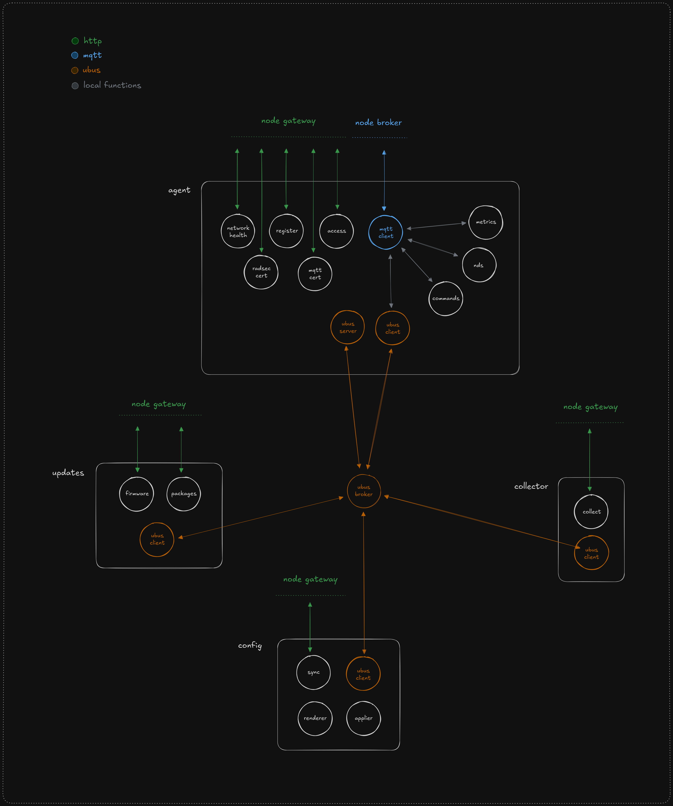

# fry-os-services
Set of services for OpenWrt-based firmware for Fry Networks WiFi offloading.



**fry-agent**
- registration
- access token
- mqtt
- metrics
- updates
- misc

**fry-collector**
- log collection

**fry-config**
- config sync

## Overview

This repository is part of the Fry Networks DePIN (Decentralized Physical Infrastructure Network) ecosystem. It provides WiFi offloading services that enable partnerships with LTE providers (like T-Mobile) for seamless connectivity handoffs between cellular and WiFi networks.

This service works in conjunction with [wifi-offloading](https://github.com/Fry-Foundation/wifi-offloading) for the complete WiFi offloading solution.

## Dependencies
### Build
Install the OpenWrt build system dependencies needed for your system: [Build system setup](https://openwrt.org/docs/guide-developer/toolchain/install-buildsystem)

Also:
- cmake
- just
- go
- docker

### Libraries
- libcurl
- libjson-c
- libmosquitto
- libssl
- liblua
- libubox, see [docs/dependency_libubox](./docs/dependency_libubox.md)
- libubus, see [docs/dependency_libubus_and_ubus](./docs/dependency_libubus_and_ubus.md)

## Development
This project is written in C with supporting shell and Lua scripts.

It is split between apps and libraries. Check the `./apps` and `./libs` directories.

## Workflows
Build the project; will build all apps:
```bash
just build
```

Clean the project:
```bash
just clean
```

Run any of the apps in the `./apps` directory:
```bash
just run <app>
```

Compile the project:
```bash
just compile arch=<value>
```
> Compilations are done using the OpenWrt SDK inside a Debian Docker container. The operation is orchestrated by a small program built with Go.

The compiled package will be available in a new folder called `./output/<arch>/<package>.ipk`

You can then transfer the compiled package to a router for testing.

Format the C files in the project:
```bash
just format
```
> Requires `clang-format` to be installed.

Build compilation symbols:
```bash
just compdb
```
This can help if your IDE is not recognizing the include paths correctly and is reporting a lot of linting errors.

## Contributing

This project is open source. Contributions are welcome! Please follow these guidelines:

1. Fork the repository
2. Create a feature branch
3. Make your changes
4. Add tests if applicable
5. Submit a pull request

## License

This project is licensed under the MIT License.

## Support

For issues, questions, or contributions, please use the GitHub Issues section.

---

**Note**: This project is maintained by Fry Networks and The Fry Foundation. The community is welcome to use, modify, and improve this codebase.
